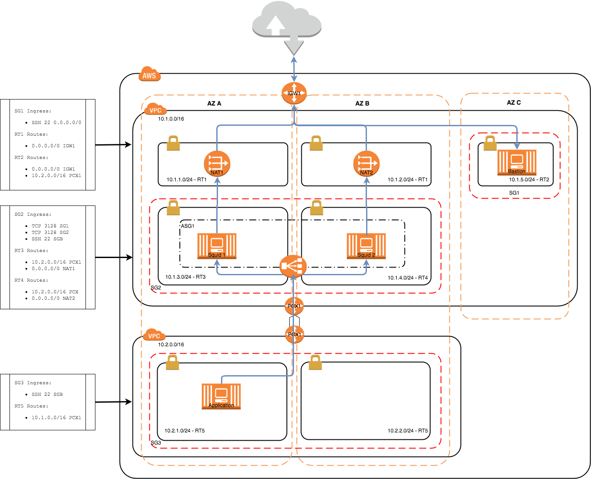

# AWS / Terraform Squid Proxy VPC

This project puts together a public network containing an auto scaled group of [Squid Proxy](http://squid-proxy.net/) servers configured 
to access the internet using NAT Gateways and an egress Internet Gateways. A private VPC is also created peered with the public VPC with proxy 
traffic routed to the Squid Proxy Elastic Load Balancer.
The provisioning of all the infrastructure and services is done using [Terraform](https://www.terraform.io/).
All compute servers use the T2 micros with Amazon Linux, note that the architecture shown below requires a region with a minimum of 3 availability zones.




## Squid Configuration

The Squid Proxy has been configured for testing purposes.
The following changes have been made to the configuration found in _/etc/squid/squid.conf_

### Network Configuration

The network can be configured to accept single IP addresses or CIDR ranges. In our case we grant access all local traffic in 
the public and private VPC

```commandline
acl localnet src 10.1.0.0/16
acl localnet src 10.2.0.0/16
```

### Access Control

We can control access to domains and websites, in our example we control access to the AWS SQS service and the Amazon AWS website it self.

```commandline
acl whitelist dstdomain sqs.us-west-1.amazonaws.com
acl whitelist dstdomain sqs.us-west-2.amazonaws.com
acl whitelist dstdomain sqs.eu-west-1.amazonaws.com
acl whitelist dstdomain sqs.eu-west-2.amazonaws.com
acl whitelist dstdomain sqs.eu-central-1.amazonaws.com
acl whitelist dstdomain sqs.ap-southeast-1.amazonaws.com
acl whitelist dstdomain sqs.ap-northeast-1.amazonaws.com
acl whitelist dstdomain sqs.sa-east-1.amazonaws.com
acl whitelist dstdomain sqs.ap-southeast-2.amazonaws.com
acl whitelist dstdomain www.amazonaws.com
```

## Set-Up

You will need the following tools and accounts to make it happen

### AWS Account

You will need an AWS account, just [Sign-Up](https://aws.amazon.com/free)

### SSH Key

You will need to set-up your desired AWS region with a secure key pair.
This project is using London (eu-west-2) as the region I suggest you keep this the same as there are AMI's referenced that are region sensitive.

[EC2 Key Pairs](http://docs.aws.amazon.com/AWSEC2/latest/UserGuide/ec2-key-pairs.html) has instructions on how to set-up your key pair.

Once you have set-up key pair you will have access to the PEM file that needs to be stored safely.
Terraform assumes that the PEM is available in your local key chain, you can add it it to your key-chain by running the following command

```commandline
ssh-add -K your-key.pem
```

### Terraform

Install terraform command line tool. Depends on your OS, [Install Terraform](https://www.terraform.io/intro/getting-started/install.html) has some descent instructions.

If you are using OSX I suggest you use [Homebrew](https://brew.sh/) to install the terraform package.

## Building / Running

### Plan

I suggest that you run a plan to determine that access to your AWS account is as expected.
Run the following command in the root of the terraform source _src/main/terraform_


```commandline
terraform plan -var 'aws_key_name=your-key.pem'
```

The output of this command will detail all the resources that will be created once applied.
Note that the default region is set to _eu-west-1_, this value along with others can be overriden e.g.

```commandline
terraform plan -var 'aws_key_name=your-key.pem' -var 'aws_region=us-east-1'
```

### Apply

Once you are happy with the plan apply the changes as follows

```commandline
terraform apply -var 'aws_key_name=your-key.pem'
```

### Testing

The best way to test the application is to SSH on to the test host and attempt accessing the internet.

1. Copy your EC2 key to the bastion host - _scp -i <YOUR_KEY>.pem <YOUR_KEY>.pem ec2-user@<BASTION_HOST_IP>:.ssh/_
2. SSH to the bastion host - _ssh ~/.ssh/<YOUR_KEY>.pem ec2-user@<BASTION_HOST_IP>_
3. SSH to the application host - _ssh ~/.ssh/<YOUR_KEY>.pem ec2-user@<APPLICATION_HOST_IP>_
4. cURL a valid website; you should see output that looks like the following
```
>curl -I http://www.amazonaws.com
HTTP/1.1 302 Found
...
Via: 1.1 ip-10-1-3-240 (squid/3.5.20)
Connection: keep-alive
```
4. cURL an invalid website; you should see output that looks like the following
```
>curl -I http://www.amazonaws.com
HTTP/1.1 403 Access Denied
...
Via: 1.1 ip-10-1-3-240 (squid/3.5.20)
Connection: keep-alive
```

The above test proves that access to the internet fromthe private VPC hosted application server can only be achieved 
through the white listed proxy. To prove this you could remove the export for the _http_proxy_ settings and retry cURL 
test above; you will find that it timesout because there is no valid route to the internet gateway.

### Destroy

Clean up your environment by detroying, this will remove all traces:

```commandline
terraform destroy -var 'aws_key_name=your-key.pem'
```

### Troubleshooting

TODO - add FAQ for potential issues 